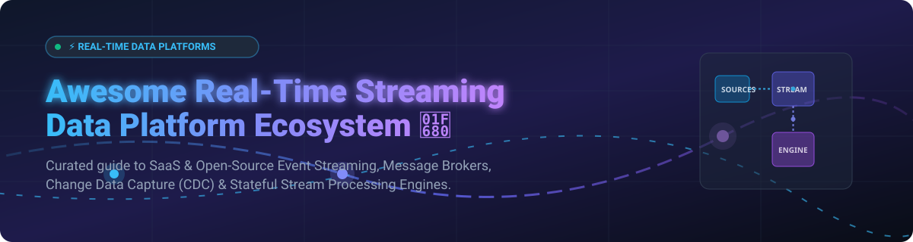

# ⚡ Awesome Real-Time Streaming Data Platform

       

## 📌 Top Real-Time Streaming Data Platform Ecosystem

**A Curated List of SaaS Products, Cloud Native Services & Open-Source GitHub Projects**  
*Focused on Event Streaming, Distributed Message Brokers, Change Data Capture (CDC) & Stream Processing Engines.*

> **Last updated:** October 2026

---

### 🌐 SEO & Architecture Overview
This directory tracks notable **commercial real-time streaming data platforms** and **open-source data streaming projects** that ingest, buffer, process, and distribute continuous telemetry data streams — powering event-driven microservices architectures, real-time data analytics, and low-latency ETL pipelines.

---

## 📑 Table of Contents
- [☁️ SaaS / Hosted Streaming Data Platforms](#️-saas--hosted-streaming-data-platforms)
- [🔓 Open-Source GitHub Projects](#-open-source-github-projects)
- [🤝 How to Contribute](#-how-to-contribute)
- [💖 Support & Sponsorship](#-support--sponsorship)
- [⭐ Star History](#-star-history)
- [⚠️ Disclaimer](#️-disclaimer)

---

## ☁️ SaaS / Hosted Streaming Data Platforms

**Estimated Market Size & Structure:** The global real-time streaming data platform market size is estimated at **$12.5 Billion in 2026** (projected to reach **$38.4 Billion by 2032 at a 20.5% CAGR**). The sector is **moderately fragmented**: hyper-scaler cloud providers (AWS, Azure, GCP) command general cloud workload streaming, while specialized event-driven infrastructure platforms (Confluent, Redpanda, Aiven, StreamNative) capture high-performance and dedicated multi-cloud streaming workloads.

*Sorted by Company Size / Market Valuation (Descending).*

| 🏢 Platform / SaaS Product | 💰 Company Size / Valuation | 🏷️ Starting Tier Pricing | 🎁 Free Tier / Trial Limits |
| :--- | :--- | :--- | :--- |
| **[Azure Event Hubs](https://azure.microsoft.com/en-us/products/event-hubs/)**   Azure's enterprise data streaming platform for ingesting millions of events per second. | **~$3.1 Trillion** *(Microsoft Market Cap)* | **$0.015/hour** per Standard Throughput Unit ($0.03/GB) | **1,000,000 operations/month** free for 12 months + $200 Azure credit |
| **[Amazon Kinesis](https://aws.amazon.com/kinesis/)**   AWS fully managed real-time streaming data platform service (Kinesis Data Streams & Firehose). | **~$2.1 Trillion** *(Amazon Market Cap)* | **$0.015/shard-hour** + $0.014 per 1M PUT Payload Units | **1,000,000 PUT operations/month** free for 12 months + $200 AWS credit |
| **[Google Cloud Pub/Sub](https://cloud.google.com/pubsub)**   Google's global asynchronous pub/sub messaging and event streaming service. | **~$2.0 Trillion** *(Alphabet Market Cap)* | **$0.04 per GB** ingested ($40.00/TiB for first 10 TiB/mo) | **10 GB message data transfer/month** (Free Forever) + $300 trial credit |
| **[Confluent Cloud](https://www.confluent.io/confluent-cloud/)**   Fully managed Apache Kafka, ksqlDB, and Apache Flink enterprise event streaming. | **~$7.5 Billion** *(NASDAQ: CFLT)* | **$0.10/hour** per Basic cluster + $0.13 per GB ingested | **30-Day Free Trial with $400 credits** (No credit card required) |
| **[Aiven for Apache Kafka](https://aiven.io/kafka)**   Fully managed multi-cloud Apache Kafka event streaming and connector ecosystem. | **~$3.0 Billion** *(Private Valuation)* | **$0.08/hour** ($58.40/month) for Startup-4 tier | **30-Day Free Trial with $300 credits** (No credit card required) |
| **[Redpanda Cloud](https://redpanda.com/)**   C++ Kafka-compatible streaming engine delivering high performance without JVM or ZooKeeper. | **~$750 Million** *(Private Valuation)* | **$0.08 per GB** for serverless data transfer + $0.05/GB-mo storage | **14-Day Free Trial with $300 credits** for Dedicated & Serverless clusters |
| **[StreamNative Cloud](https://streamnative.io/)**   Cloud-native event streaming and stream processing powered by Apache Pulsar and Apache Flink. | **~$150 Million** *(Private Valuation)* | **$0.15/hour** per streaming node ($0.10/GB data transfer) | **14-Day Free Trial with $300 credits** |
| **[Upstash Kafka](https://upstash.com/)**   Serverless serverless pay-per-request Kafka messaging engine for cloud applications. | **~$100 Million** *(Private Valuation)* | **$0.20 per 100,000 commands** ($0.60/GB data transfer) | **10,000 requests/day & 256 MB storage limit** (Free Forever) |
| **[Decodable](https://www.decodable.co/)**   Managed real-time stream processing and SQL data pipeline platform built on Apache Flink. | **~$50 Million** *(Private Valuation)* | **$0.25 per Compute Unit (CU) hour** + $0.10/GB processed | **1 Compute Unit (CU) & 10 GB data processed/month** (Free Forever) |

---

## 🔓 Open-Source GitHub Projects

The real-time streaming ecosystem features a vibrant open-source ecosystem spanning **distributed message brokers**, **change data capture (CDC)**, and **stateful stream processors**.

*Sorted by GitHub Stars_Count (Descending).*

1. ⚡ **[Apache Spark](https://github.com/apache/spark)**   
   **Unified engine for large-scale data processing and Spark Structured Streaming.** Apache-2.0 licensed. Offers stream-batch unification with micro-batch processing and sub-millisecond continuous processing mode. **Best for analytics pipelines with existing Spark deployments.**

2. 🐘 **[Apache Kafka](https://github.com/apache/kafka)**   
   **The de facto standard for distributed event streaming.** Apache-2.0 licensed. High-throughput, fault-tolerant pub/sub messaging engine featuring Kafka Connect and Kafka Streams library. **Best for enterprise event streaming at scale.**

3. 🐿️ **[Apache Flink](https://github.com/apache/flink)**   
   **The gold standard for stateful stream processing.** Apache-2.0 licensed. Delivers event-time processing, low-latency streaming analytics, savepoints, and exactly-once processing guarantees. **Best for stateful low-latency stream processing.**

4. 📦 **[NSQ](https://github.com/nsqio/nsq)**   
   **Real-time distributed messaging platform designed for scale.** MIT licensed. Lightweight, easy to configure, and optimized for high-throughput message routing without single points of failure. **Best for simple, highly available message queues.**

5. 📐 **[Vector](https://github.com/vectordotdev/vector)**   
   **High-performance observability data pipeline.** MPL-2.0 licensed. Built in Rust to collect, transform, and route logs, metrics, and event streams with minimal overhead. **Best for high-volume telemetry and log streaming.**

6. 🚀 **[Apache RocketMQ](https://github.com/apache/rocketmq)**   
   **Distributed messaging and streaming data platform.** Apache-2.0 licensed. Offers ultra-low latency, transactional messaging, and massive message backlog handling. **Best for financial services and e-commerce transactions.**

7. ⚡ **[NATS](https://github.com/nats-io/nats-server)**   
   **Cloud-native connective technology for pub/sub messaging.** Apache-2.0 licensed. High-speed messaging server with JetStream persistence engine. **Best for edge computing, microservices, and IoT streams.**

8. 🌌 **[Apache Pulsar](https://github.com/apache/pulsar)**   
   **Multi-tenant, cloud-native distributed messaging and streaming.** Apache-2.0 licensed. Features decoupled compute and storage (BookKeeper), multi-tenancy, tiered storage, and geo-replication. **Best for multi-tenant enterprise event streaming.**

9. 🪵 **[Logstash](https://github.com/elastic/logstash)**   
   **Server-side data processing pipeline.** Apache-2.0 licensed. Ingests data from multiple sources simultaneously, transforms it, and sends it to your favorite stash. **Best for Elastic Stack log and metric pipelines.**

10. 🌊 **[Fluentd](https://github.com/fluent/fluentd)**   
    **Unified logging layer for data collection.** Apache-2.0 licensed (CNCF Graduated Project). Decouples data sources from backend systems with 500+ plugins. **Best for cloud-native log aggregation.**

11. 🔄 **[Debezium](https://github.com/debezium/debezium)**   
    **Open-source distributed platform for Change Data Capture (CDC).** Apache-2.0 licensed. Captures row-level database changes in real-time from MySQL, PostgreSQL, MongoDB, and Oracle. **Best for database replication and real-time CDC sync.**

12. 🐼 **[Redpanda](https://github.com/redpanda-data/redpanda)**   
    **Kafka-compatible streaming engine in C++.** BSL licensed. Eliminates JVM garbage collection pauses and ZooKeeper dependencies while maintaining API compatibility with Kafka. **Best for low-latency Kafka alternative deployments.**

13. 🌊 **[Apache SeaTunnel](https://github.com/apache/seatunnel)**   
    **High-performance distributed data integration platform.** Apache-2.0 licensed. Synchronizes massive quantities of real-time streaming and batch data across heterogeneous engines. **Best for enterprise data synchronization.**

14. 🦫 **[Benthos / Redpanda Connect](https://github.com/redpanda-data/connect)**   
    **Declarative stream processing engine without code.** Apache-2.0 licensed. Perform data mapping, transformation, and enrichment via simple YAML configurations. **Best for lightweight declarative streaming pipelines.**

15. 🌊 **[Apache Beam](https://github.com/apache/beam)**   
    **Unified programming model for batch and stream processing.** Apache-2.0 licensed. Execute portable data pipelines across multiple execution engines including Flink, Spark, and GCP Dataflow. **Best for multi-runner portable streaming pipelines.**

16. 🐝 **[Fluent Bit](https://github.com/fluent/fluent-bit)**   
    **Super fast, lightweight log and metrics processor.** Apache-2.0 licensed. Written in C for low footprint memory and CPU usage on Kubernetes and edge environments. **Best for Kubernetes pod logging and edge telemetry.**

17. 🌩️ **[Apache Storm](https://github.com/apache/storm)**   
    **Distributed real-time computation system.** Apache-2.0 licensed. Processes unbounded streams of data with simple programming semantics and guaranteed message processing. **Best for legacy real-time stream computation.**

18. 🎯 **[Hazelcast](https://github.com/hazelcast/hazelcast)**   
    **In-memory event stream processing and data grid engine.** Apache-2.0 licensed. Combines distributed in-memory storage with real-time stream processing engines. **Best for ultra-low latency in-memory stream processing.**

19. 🔀 **[Apache NiFi](https://github.com/apache/nifi)**   
    **Visual dataflow management and streaming data distribution.** Apache-2.0 licensed. Provides direct flow management, backpressure control, and dynamic prioritization. **Best for graphical enterprise data routing.**

20. 🌊 **[Apache Flume](https://github.com/apache/flume)**   
    **Distributed, reliable log collection and aggregation service.** Apache-2.0 licensed. Efficiently collects, aggregates, and moves large amounts of log data to central stores. **Best for legacy Hadoop log ingestion.**

21. 🐹 **[Apache Samza](https://github.com/apache/samza)**   
    **Distributed stream processing framework.** Apache-2.0 licensed. Built by LinkedIn to handle stateful stream processing on top of Apache Kafka and YARN. **Best for stateful Kafka-native application processing.**

22. 📊 **[ksqlDB](https://github.com/confluentinc/ksql)**   
    **Streaming database for building stream processing applications on Kafka.** Confluent Community License. Executes real-time SQL queries over Kafka event topics. **Best for SQL-driven Kafka stream processing.**

---

## 🤝 How to Contribute

We welcome community contributions! Follow these steps:

1. 🍴 **Fork** this repository.
2. 📝 **Add or edit** entries in `README.md` following the tabular or bullet format.
3. 🔎 **Provide factual details:** Name, official URL, pricing tier, free tier limits, and GitHub star links.
4. 🚀 **Submit a Pull Request (PR)** with a clear title and description.

⭐ **Don't forget to star this repository if you find it helpful!**

---

## 💖 Support & Sponsorship

If you find this real-time streaming data platform resource valuable, please consider supporting the project:
- ⭐ **Star** this repository to help others discover it.
- 🍴 **Fork** and contribute new tools, platforms, or data processing frameworks.
- 📢 **Share** this list with fellow data engineers, architects, and platform engineering teams.
- ☕ **Sponsor / Buy Me a Coffee:** Support ongoing maintenance and curation via [GitHub Sponsors](https://github.com/sponsors/ishandutta2007).

---

## ⭐ Star History

---

## ⚠️ Disclaimer

- 📌 This is a **community-curated list** provided for educational and evaluation purposes. It is not an official endorsement of any commercial product or open-source software.
- 🔒 **Security & Compliance:** Real-time streaming data platforms handle continuous, high-volume data streams. Self-hosted deployments require continuous security hardening, TLS encryption, RBAC, and data privacy compliance (GDPR, HIPAA).
- 📜 **Licensing Considerations:** Verify licenses before committing production workloads. While Apache Spark, Kafka, and Flink use Apache-2.0, Redpanda uses BSL, ksqlDB uses Confluent Community License, and Vector uses MPL-2.0.
- 🎯 **Delivery Guarantees:** Exactly-once processing (EOS) semantics vary across Kafka, Pulsar, NATS, and Flink. Understand ordering, partitioning, and idempotency guarantees prior to architectural design.

---

  <b>Built with ❤️ for data engineers, platform teams, and event-driven architecture builders.</b>

